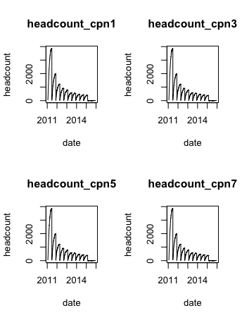

# Employee-Retention
Analyze main factors driven employee churn & random forest model tuning

## Challenge Description
We got employee data from a few companies. We have data about all employees who joined from 2011/01/24 to 2015/12/13. For each employee, we also know if they are still at the company as of 2015/12/13 or they have quit. Beside that, we have general info about the employee, such as avg salary during her tenure, dept, and yrs of experience.
As said above, the goal is to predict employee retention and understand its main drivers. Specifically, you should:

1. Assume, for each company, that the headcount starts from zero on 2011/01/23. Estimate employee headcount, for each company, on each day, from 2011/01/24 to 2015/12/13. That is, if by 2012/03/02 2000 people have joined company 1 and 1000 of them have already quit, then company headcount on 2012/03/02 for company 1 would be 1000. **You should create a table with 3 columns: day, employee_headcount, company_id.**
2. What are the main factors that drive employee churn? Do they make sense? Explain your findings.
3. If you could add to this data set just one variable that could help explain employee churn, what would that be?

Note:
comments are embedded in the code file

## EDA
I looked at the distribution the data and the values counts for the various numeric and categorical variables. Below are some highlights discoveries from the table. 

 

## Random Forest
Some highlights from random forest model.

## Boosted Trees
Some highlights from boosted trees model.

## CONCLUSION: 
hiring length and salary is the main factor drive 
employees to quit and leave. Reasonably, company always has more 
budget to hire new staff and people tend to have a clear cut off 
point when they plan to leave in their mind, for example, one year 
or one year and half seems to be the good period of time for people 
to age and feel the company culture. Additionally, employees at customer
service seems to have a rather strong motivation to leave, whereas
employees at data science dept tend to have longer retention, although
dept has relatively lower marginal effect.
